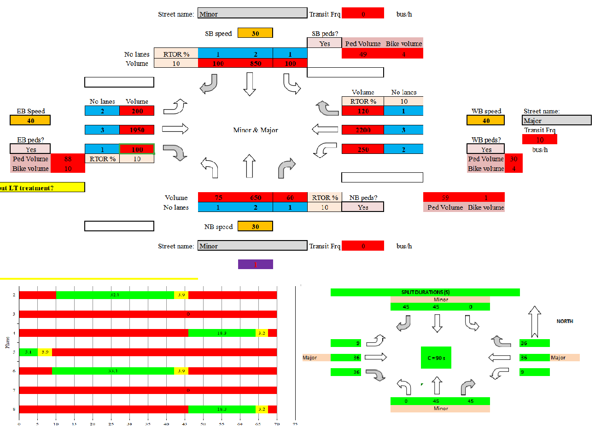
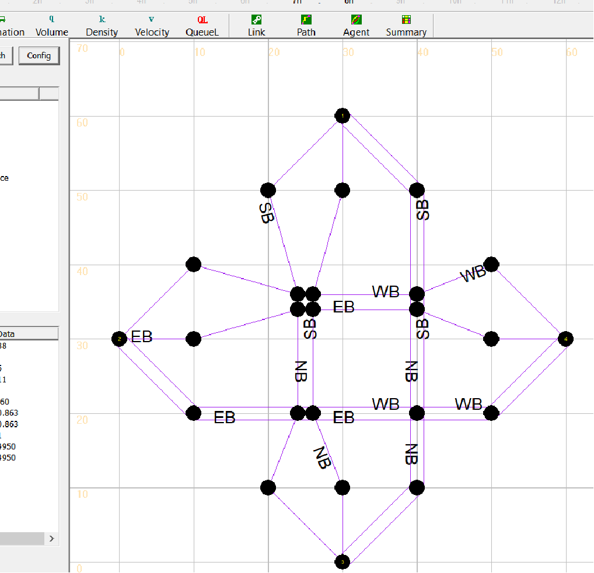

# Data2SignalTiming
Quick Estimation Method based implementation, GMNS based traffic signal API for multi-resolution modeling

This tool aims to automate the process of optimizing movement-based, phase-based signal control strategy and provide the interfaces for AMS modeling 

The users and students can follow the steps below to learn and use this set of tools.

Step 1: Please check out the tool developed by Dr. Milan Zlatkovic at  University of Wyoming (http://www.uwyo.edu/civil/faculty_staff/faculty/milan-zlatkovic/index.html, mzlatkov@uwyo.edu)
Excel based Quick Estimation Method 
https://github.com/milan1981/Sigma-X

#Highlights:
Planning-level analysis of existing intersections
Estimation of signal timing parameters for known inputs
Steps:
Left-turn treatment
Lane volume
Signal timing
Critical intersection volume-to-capacity ratio
Control delay & LOS

Step 2:Pathon based, GMNS based version for movement-based, phase-based signal control strategy optimization
Developed by the research team led by Dr. Xuesong (Simon) Zhou at Arizona State University (xzhou74@asu.edu) and Dr. Milan Zlatkovic at  University of Wyoming
https://github.com/xzhou99/SignalAPI/blob/master/src/Exe_src/AgentLite/main_api.cpp

